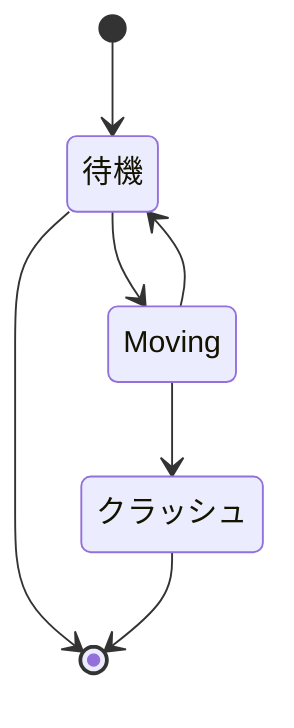
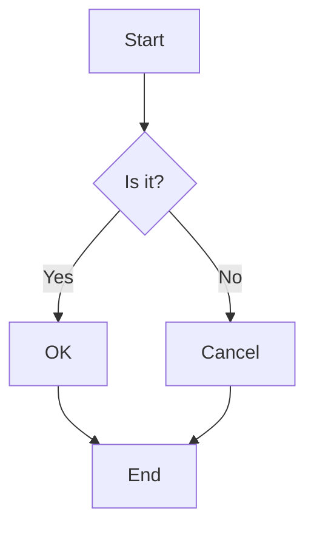
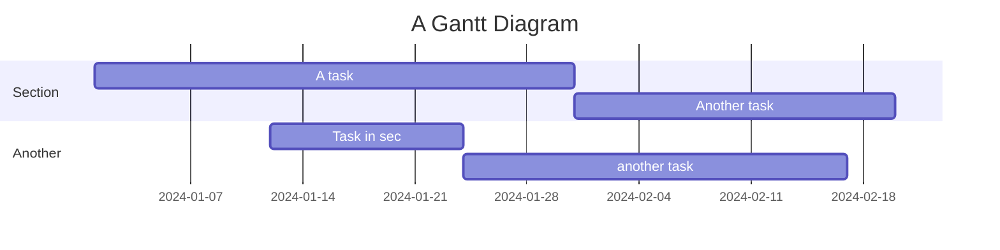

# mymmd1

### title?

```mermaid
stateDiagram-v2
    [*] --> 待機
    待機 --> [*]
    待機 --> Moving
    Moving --> 待機
    Moving --> クラッシュ
    クラッシュ --> [*]
```

### ok!

```mermaid
graph TD;
    A-->B;
    A-->C;
    B-->D;
    C-->D;
```

### now

```mermaid
graph TD;
    A[Start] --> B{Is it?};
    B -->|Yes| C[OK];
    B -->|No| D[Cancel];
    C --> E[End];
    D --> E;
```

```mermaid

gantt
    title A Gantt Diagram
    dateFormat  YYYY-MM-DD
    section Section
    A task           :a1, 2024-01-01, 30d
    Another task     :after a1  , 20d
    section Another
    Task in sec      :2024-01-12  , 12d
    another task     : 24d

```
