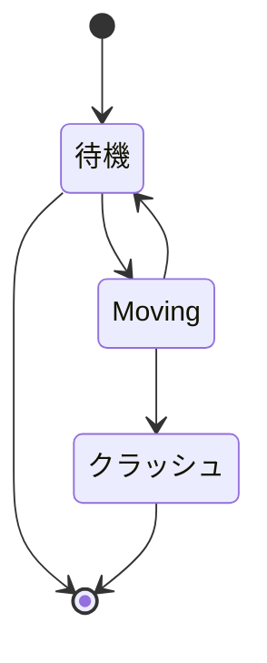

# mymmd1

### title?

```mermaid
stateDiagram-v2
    [*] --> 待機
    待機 --> [*]
    待機 --> Moving
    Moving --> 待機
    Moving --> クラッシュ
    クラッシュ --> [*]
```

### ok!

```mermaid
graph TD;
    A-->B;
    A-->C;
    B-->D;
    C-->D;
```
